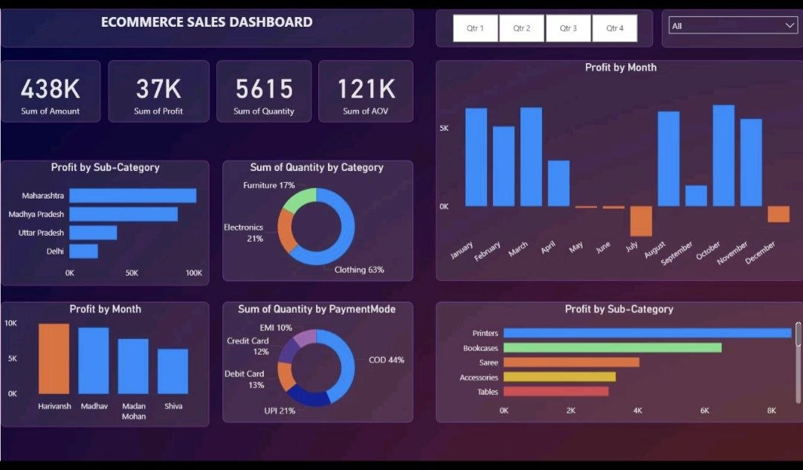

# 🛒 E-Commerce Sales Dashboard

An interactive Power BI dashboard designed to analyze e-commerce sales performance, profitability, order volume, category breakdowns, and customer payment behaviors to support data-driven decision making.

---

## 📊 Dashboard Overview



---

## 🔑 Key Metrics (KPIs)

* **Total Revenue (Amount):** 438K
* **Total Profit:** 37K
* **Total Quantity Sold:** 5,615 units
* **Average Order Value (AOV):** 121K

---

## 💡 Key Insights & Features

* **Category Distribution:**
  * **Clothing:** Dominates order volume at **63%**.
  * **Electronics:** Represents **21%** of total sales.
  * **Furniture:** Accounted for **17%** of sales volume.

* **Payment Method Analysis:**
  * **Cash on Delivery (COD)** is the most popular payment method (**44%**).
  * **UPI** follows at **21%**, with Debit Card (**13%**), Credit Card (**12%**), and EMI (**10%**).

* **Geographic & Sub-Category Insights:**
  * Highest profitable states include **Maharashtra**, **Madhya Pradesh**, and **Uttar Pradesh**.
  * Top performing sub-categories in profitability include **Printers**, **Bookcases**, and **Sarees**.

---

## 📁 Repository Structure

```text
├── Details (1).csv          # Order details including Amount, Profit, Quantity, Category, Sub-Category & Payment Mode
├── Orders (1).csv           # Customer demographics, Order Dates, Cities, and States
├── 6046563162879889148.jpg  # Dashboard Visual Preview Image
└── README.md                # Project Overview & Documentation
